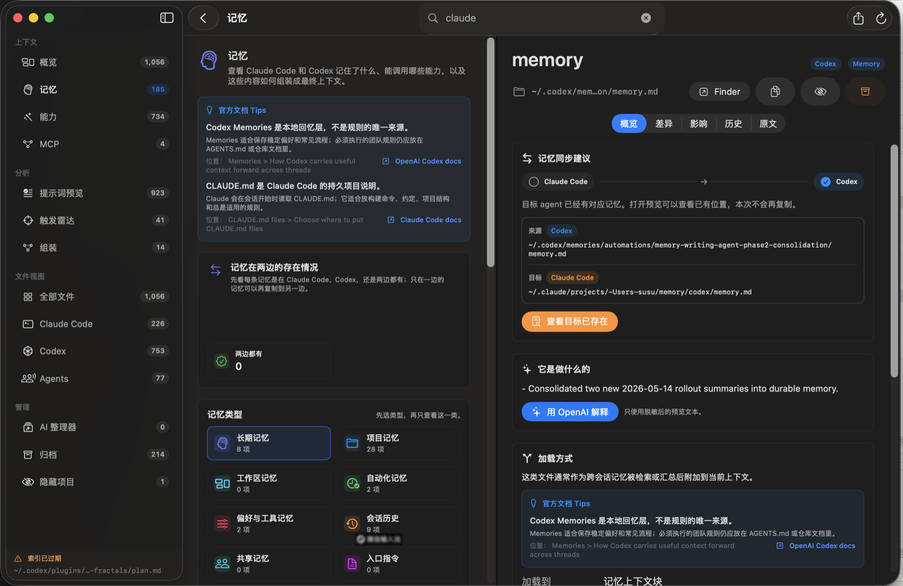

<h1 align="center">Agent Observatory</h1>

<p align="center">
  用来检查、理解和管理本地 AI Agent 文件的原生 macOS 控制台。
</p>

<p align="center">
  <a href="README.md">English</a>
  ·
  简体中文
  ·
  <a href="README.zh-TW.md">繁體中文</a>
</p>

<p align="center">
  <a href="#界面预览">界面预览</a>
  ·
  <a href="#快速开始">快速开始</a>
  ·
  <a href="#隐私优先">隐私优先</a>
  ·
  <a href="#架构">架构</a>
  ·
  <a href="docs/ROADMAP.md">路线图</a>
  ·
  <a href="https://github.com/674019130/agent-observatory/releases/tag/v0.2.2">v0.2.2 Release</a>
</p>

---

Agent Observatory 把 Claude Code、Codex、本地 agent skills、commands、
memories、rules、MCP 配置和项目级说明集中到一个地方，帮助你看清楚这些
文件正在怎样影响本机的 AI 编程工具。

它适合同时使用多个 AI coding tool 的人：当你逐渐记不清哪个工具加载了哪段
memory、哪个 skill 会抢答、哪些命令还引用旧路径时，Agent Observatory 可以
做聚焦扫描、分类、解释、漂移检测，并提供隐藏和归档这类可恢复的整理动作。

## 界面预览

<p align="center">
  
</p>

这个界面按原生 Mac 控制台来设计：左侧是安静的 source list，中间是高密度的
上下文卡片，右侧是滚动时始终留在视口内的 inspector。紧凑 badge、路径预览、
迁移状态和 Finder-first 的文件动作，让很大的 Claude Code / Codex 配置也能保持
可扫描、可理解。

## 功能

- **聚焦的本地扫描**
  扫描 Claude、Codex、Agents、插件和项目来源，不会爬完整个文件系统。
  项目级来源会从可配置的 Project Folder 解析，避免应用启动位置影响结果。

- **带上下文的搜索**
  支持按标题、摘要、路径、预览文本、依赖、触发条件和状态标记搜索。

- **Claude Code 与 Codex 的上下文浏览器**
  并排查看 memories、capabilities 和上下文组装步骤，弄清哪些文件会成为
  prompt material、注册表、辅助文件或历史记录。界面中的小 Tips 会链接到
  OpenAI 和 Claude Code 官方文档位置。大量 capability 会按安装包或仓库归组并
  默认折叠；MCP 单独成区，避免 skill 和工具服务器混在一起。

- **Memory 迁移预览**
  先展示某条 memory 存在于 Claude Code、Codex，还是两边都有，再决定是否复制到
  另一套 agent system。执行前会检查目标文件是否已存在，明确显示会创建、跳过，
  还是需要人工确认。

- **Skill 触发雷达**
  识别用户、项目、内置和插件 skills 之间的意图重叠，避免错误能力先响应。
  复制出去的处理提示词会带上必需的 Markdown 输出格式。

- **风险与漂移 Dashboard**
  集中查看过期路径、重复身份、不可读文件、大文件、缺少说明、依赖热点，以及
  Claude 和 Codex 之间的漂移。

- **带脱敏的 AI 解释**
  使用你自己的 OpenAI API key 生成简短解释。敏感文件会在本地识别，并从 LLM
  enrich 流程中排除。

- **原始内容查看**
  需要时可以打开完整原文；大文件会先预检，敏感内容会脱敏。被截断的路径可以
  悬浮查看完整路径，点击后在 Finder 中定位。

- **软管理工具**
  可以把噪音文件从主索引隐藏，之后再恢复；也可以归档到受管理位置，并支持恢复。
  复制和迁移动作会进入预览弹窗，让源文件、目标文件和覆盖状态在写入前可见。

- **双语界面**
  可在 Settings 中切换 English 和简体中文。

## 快速开始

要求：

- macOS 14 或更新版本
- Xcode command line tools
- Swift 5.9+

克隆并运行：

```bash
git clone https://github.com/674019130/agent-observatory.git
cd agent-observatory
./script/build_and_run.sh
```

运行测试：

```bash
swift test
```

构建并验证应用能启动：

```bash
./script/build_and_run.sh --verify
```

启动后，打开 Settings -> Sources，设置你想观察的仓库或工作区作为 Project
Folder。应用会把该目录保存到本地偏好设置，并用它解析项目级 `AGENTS.md`、
`CLAUDE.md`、`.mcp.json`、`.codex` 和 `.claude` 来源。

打包本地 release zip：

```bash
./script/package_release.sh v0.2.2
```

最新打包版本是
[Agent Observatory v0.2.2](https://github.com/674019130/agent-observatory/releases/tag/v0.2.2)。

## 会找到什么

Agent Observatory 会查找这些本地 agent 资产：

- skills 和 `SKILL.md` 文件
- slash commands
- memory 和 instruction 文件
- rule 文件
- MCP 配置
- plugin metadata
- agent workflow 相关脚本
- 包含 Markdown 或纯文本上下文的 workspace memory 文件夹
- 不应发送给 LLM 的敏感配置文件

扫描器使用显式来源定义、深度限制，以及扫描和文件监听共用的规则解析器。你可以在
Settings 中启用、禁用、添加 workspace memory 文件夹、设置项目目录或重置来源。

## 隐私优先

Agent Observatory 是 local-first：

- 文件在本地扫描。
- API key 存储在 macOS Keychain。
- OpenAI enrich 使用你自己的 API key。
- 只有脱敏预览会发送给 AI 解释流程。
- auth、token、key 等敏感路径会被阻止预览和 LLM enrich。
- 隐藏和归档状态保存在本地 `UserDefaults`。

## 架构

项目是 SwiftPM package，包含两个 target：

```text
AgentObservatory
├─ AgentObservatory        # SwiftUI macOS app
└─ AgentObservatoryCore    # 扫描、分类、脱敏、diff、归档逻辑
```

核心服务包括：

- `AssetSourceRules`：扫描器和文件监听器共享的匹配规则
- `FileSystemAssetScanner`：带进度的聚焦流式扫描
- `AssetClassifier`：提取名称、摘要、触发条件和健康标记
- `ContextLoadAnalyzer` / `ContextCatalogAnalyzer`：解释本地文件如何进入 Claude Code 和 Codex 的 memory、capability、assembly surface
- `SkillTriggerConflictAnalyzer`：发现重叠的 skill trigger contracts
- `DashboardAnalyzer`：风险排序和依赖热点
- `AssetImpactAnalyzer`：incoming/outgoing 引用分析
- `RawContentReader`：安全的完整内容查看
- `AssetArchiveService`：软删除式归档和恢复
- `OpenAIEnricher`：可选的文件解释

## 开发

常用命令：

```bash
swift build
swift test
./script/build_and_run.sh
./script/build_and_run.sh --verify
./script/package_release.sh v0.2.2
```

应用 bundle 会生成在：

```text
dist/AgentObservatory.app
```

## 路线图

工作路线图见 [docs/ROADMAP.md](docs/ROADMAP.md)。当前方向是：

- 保持 ad-hoc release packaging，并记录 macOS 安全提示的取舍。
- 持续覆盖 context browser 选择、树懒加载、资产筛选布局、path preview、Finder 打开、
  复制预览和 OpenAI explanation 选择流程。
- 构建 memory、capability、MCP、project instruction 之间的依赖图可视化。
- 为 hide/archive 决策添加 management state import/export。
- 等 Claude Code 和 Codex 模型稳定后，添加更多 agent runtime 的 source presets。

## 许可证

MIT
