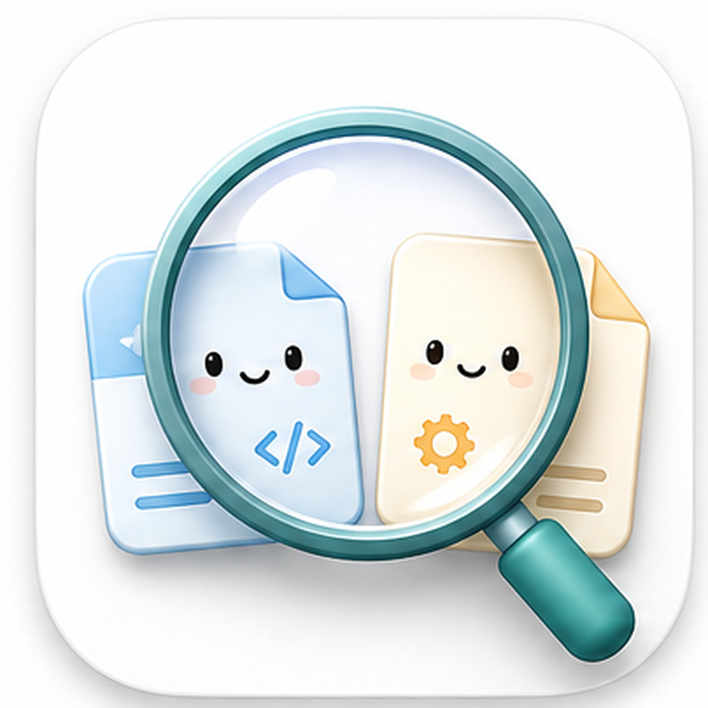
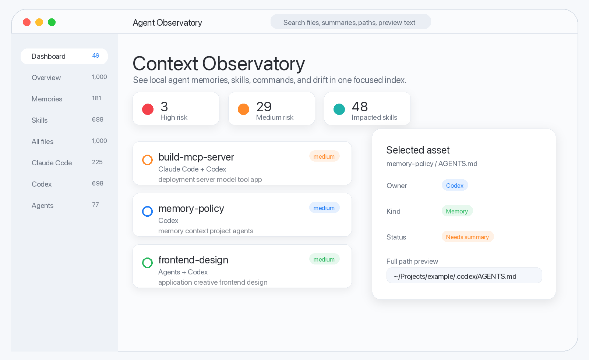
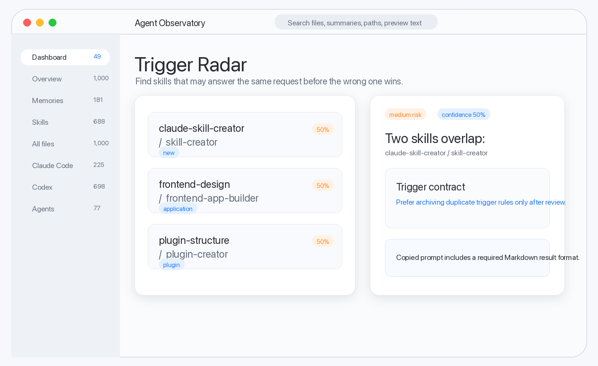
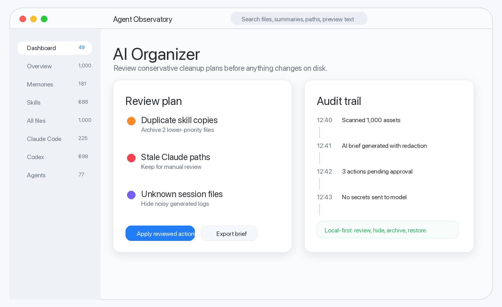

<p align="center">
  
</p>

<h1 align="center">Agent Observatory</h1>

<p align="center">
  用來檢查、理解和管理本機 AI Agent 檔案的原生 macOS 控制台。
</p>

<p align="center">
  <a href="README.md">English</a>
  ·
  <a href="README.zh-CN.md">简体中文</a>
  ·
  繁體中文
</p>

<p align="center">
  <a href="#範例圖片">範例圖片</a>
  ·
  <a href="#快速開始">快速開始</a>
  ·
  <a href="#隱私優先">隱私優先</a>
  ·
  <a href="#架構">架構</a>
  ·
  <a href="docs/ROADMAP.md">路線圖</a>
  ·
  <a href="https://github.com/674019130/agent-observatory/releases/tag/v0.2.0">v0.2.0 Release</a>
</p>

---

Agent Observatory 把 Claude Code、Codex、本機 agent skills、commands、
memories、rules、MCP 設定和專案級說明集中到一個地方，幫助你看清楚這些
檔案正在怎樣影響本機的 AI 程式開發工具。

它適合同時使用多個 AI coding tool 的人：當你逐漸記不清哪個工具載入了哪段
memory、哪個 skill 會搶答、哪些 command 還引用舊路徑時，Agent Observatory
可以做聚焦掃描、分類、解釋、漂移偵測，並提供隱藏和歸檔這類可復原的整理動作。

## 範例圖片

以下圖片使用脫敏範例資料和虛構路徑，不會暴露本機真實檔案。

| 上下文觀察台 | 觸發雷達 | AI 整理器 |
|---|---|---|
| [](docs/assets/sample-overview.png) | [](docs/assets/sample-trigger-radar.png) | [](docs/assets/sample-ai-organizer.png) |

## 功能

- **聚焦的本機掃描**
  掃描 Claude、Codex、Agents、外掛和專案來源，不會爬完整個檔案系統。
  專案級來源會從可設定的 Project Folder 解析，避免應用程式啟動位置影響結果。

- **帶上下文的搜尋**
  支援按標題、摘要、路徑、預覽文字、依賴、觸發條件和狀態標記搜尋。

- **Claude Code 與 Codex 的上下文瀏覽器**
  並排查看 memories、capabilities 和上下文組裝步驟，弄清哪些檔案會成為
  prompt material、註冊表、輔助檔案或歷史記錄。介面中的小 Tips 會連到
  OpenAI 和 Claude Code 官方文件位置。

- **Skill 觸發雷達**
  識別使用者、專案、內建和外掛 skills 之間的意圖重疊，避免錯誤能力先回應。
  複製出去的處理提示詞會帶上必需的 Markdown 輸出格式。

- **風險與漂移 Dashboard**
  集中查看過期路徑、重複身份、不可讀檔案、大檔案、缺少說明、依賴熱點，以及
  Claude 和 Codex 之間的漂移。

- **帶脫敏的 AI 解釋**
  使用你自己的 OpenAI API key 產生簡短解釋。敏感檔案會在本機識別，並從 LLM
  enrich 流程中排除。

- **原始內容查看**
  需要時可以打開完整原文；大檔案會先預檢，敏感內容會脫敏。被截斷的路徑可以
  懸浮查看完整路徑，點擊後在 Finder 中定位。

- **軟管理工具**
  可以把噪音檔案從主索引隱藏，之後再復原；也可以歸檔到受管理位置，並支援復原。

- **雙語介面**
  可在 Settings 中切換 English 和簡體中文。

## 快速開始

需求：

- macOS 14 或更新版本
- Xcode command line tools
- Swift 5.9+

複製並執行：

```bash
git clone https://github.com/674019130/agent-observatory.git
cd agent-observatory
./script/build_and_run.sh
```

執行測試：

```bash
swift test
```

建置並驗證應用程式能啟動：

```bash
./script/build_and_run.sh --verify
```

啟動後，打開 Settings -> Sources，設定你想觀察的 repo 或 workspace 作為
Project Folder。應用程式會把該目錄儲存到本機偏好設定，並用它解析專案級
`AGENTS.md`、`CLAUDE.md`、`.mcp.json`、`.codex` 和 `.claude` 來源。

打包本機 release zip：

```bash
./script/package_release.sh v0.2.0
```

最新打包版本是
[Agent Observatory v0.2.0](https://github.com/674019130/agent-observatory/releases/tag/v0.2.0)。

## 會找到什麼

Agent Observatory 會查找這些本機 agent 資產：

- skills 和 `SKILL.md` 檔案
- slash commands
- memory 和 instruction 檔案
- rule 檔案
- MCP 設定
- plugin metadata
- agent workflow 相關 script
- 包含 Markdown 或純文字上下文的 workspace memory 資料夾
- 不應送給 LLM 的敏感設定檔

掃描器使用明確來源定義、深度限制，以及掃描和檔案監聽共用的規則解析器。你可以在
Settings 中啟用、停用、新增 workspace memory 資料夾、設定專案目錄或重設來源。

## 隱私優先

Agent Observatory 是 local-first：

- 檔案在本機掃描。
- API key 儲存在 macOS Keychain。
- OpenAI enrich 使用你自己的 API key。
- 只有脫敏預覽會送給 AI 解釋流程。
- auth、token、key 等敏感路徑會被阻止預覽和 LLM enrich。
- 隱藏和歸檔狀態儲存在本機 `UserDefaults`。

## 架構

專案是 SwiftPM package，包含兩個 target：

```text
AgentObservatory
├─ AgentObservatory        # SwiftUI macOS app
└─ AgentObservatoryCore    # 掃描、分類、脫敏、diff、歸檔邏輯
```

核心服務包括：

- `AssetSourceRules`：掃描器和檔案監聽器共享的匹配規則
- `FileSystemAssetScanner`：帶進度的聚焦串流掃描
- `AssetClassifier`：提取名稱、摘要、觸發條件和健康標記
- `ContextLoadAnalyzer` / `ContextCatalogAnalyzer`：解釋本機檔案如何進入 Claude Code 和 Codex 的 memory、capability、assembly surface
- `SkillTriggerConflictAnalyzer`：發現重疊的 skill trigger contracts
- `DashboardAnalyzer`：風險排序和依賴熱點
- `AssetImpactAnalyzer`：incoming/outgoing 引用分析
- `RawContentReader`：安全的完整內容查看
- `AssetArchiveService`：軟刪除式歸檔和復原
- `OpenAIEnricher`：可選的檔案解釋

## 開發

常用命令：

```bash
swift build
swift test
./script/build_and_run.sh
./script/build_and_run.sh --verify
./script/package_release.sh v0.2.0
```

應用程式 bundle 會產生在：

```text
dist/AgentObservatory.app
```

## 路線圖

工作路線圖見 [docs/ROADMAP.md](docs/ROADMAP.md)。目前方向是：

- 保持 ad-hoc release packaging，並記錄 macOS 安全提示的取捨。
- 為 context browser、path preview、Finder 打開、OpenAI explanation 選擇流程補回歸覆蓋。
- 建立 memory、capability、MCP、project instruction 之間的依賴圖視覺化。
- 為 hide/archive 決策加入 management state import/export。
- 等 Claude Code 和 Codex 模型穩定後，加入更多 agent runtime 的 source presets。

## 授權

MIT
